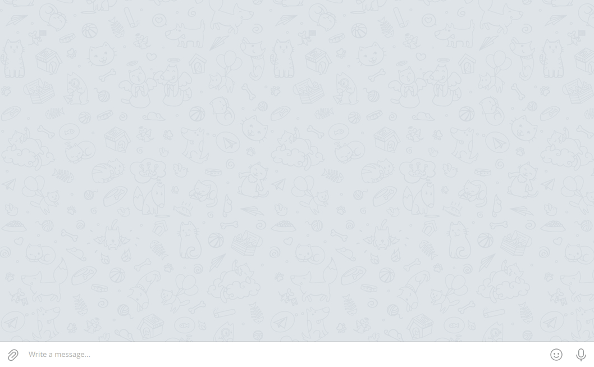

# Hoarderbot

[](https://github.com/Madh93/hoarderbot/releases)
[](https://go.dev/doc/install)
[](https://pkg.go.dev/github.com/Madh93/hoarderbot)
[](LICENSE)

`Hoarderbot` is a simple [Telegram Bot](https://core.telegram.org/bots) written in [Go](https://go.dev/) that enables users to effortlessly save bookmarks to [Hoarder](https://hoarder.app), a self-hostable bookmark-everything app, directly through Telegram.



<p align="center">
  <a href="#features">Features</a> •
  <a href="#requirements">Requirements</a> •
  <a href="#installation">Installation</a> •
  <a href="#Configuration">Configuration</a> •
  <a href="#contributing">Contributing</a> •
  <a href="#license">License</a>
</p>

## Features

- 📄 Add **text** and **URL bookmarks** into your Hoarder instance (tested on [v0.20.0](https://github.com/hoarder-app/hoarder/releases/tag/v0.20.0)).
- 🤖 Obtain **AI-generated tags** in **hashtag format** for easy searching on Telegram.
- 🔒 Support **chat ID and thread ID allowlists**.
- 🐳 **Production-ready Docker image** for easy **deployment**.

## Requirements

- A [Telegram bot token](https://core.telegram.org/bots/features#botfather) (you can get one by talking to [@BotFather](https://t.me/BotFather) on Telegram)
- A valid API key from [Hoarder](https://docs.hoarder.app/screenshots#settings).

## Installation

### Docker

#### Using `docker run`

Use the `docker run` command to start `Hoarderbot`. Make sure to set the required environment variables:

```sh
docker run --name hoarderbot \
  -e HOARDERBOT_TELEGRAM_TOKEN=your-telegram-bot-token \
  -e HOARDERBOT_HOARDER_TOKEN=your-hoarder-api-key \
  -e HOARDERBOT_HOARDER_URL=https://your-hoarder-instance.tld \
  ghcr.io/madh93/hoarderbot:latest
```

#### Using `docker compose`

Create a `docker-compose.yml` file with the following content:

```yml
services:
  hoarderbot:
    image: ghcr.io/madh93/hoarderbot:latest
    restart: unless-stopped
    # volumes:
    #   - ./custom.config.toml:/var/run/ko/config.default.toml # Optional: specify a custom configuration file instead of the default one
    environment:
      - HOARDERBOT_TELEGRAM_TOKEN=your-telegram-bot-token
      - HOARDERBOT_HOARDER_TOKEN=your-hoarder-api-key
      - HOARDERBOT_HOARDER_URL=https://your-hoarder-instance.tld
```

Use the `docker compose up` command to start `Hoarderbot`:

```sh
docker compose up
```

### From releases

Download the latest binary from [the releases page](https://github.com/Madh93/hoarderbot/releases):

```sh
curl -L https://github.com/Madh93/hoarderbot/releases/latest/download/hoarderbot_$(uname -s)_$(uname -m).tar.gz | tar -xz -O hoarderbot > /usr/local/bin/hoarderbot
chmod +x /usr/local/bin/hoarderbot
```

### From source

If you have Go installed:

```sh
go install github.com/Madh93/hoarderbot@latest
```

## Configuration

`Hoarderbot` comes with a [default configuration file](config.default.toml) that you can modify to suit your needs.

### Loading a custom configuration file

You can load a different configuration file by using the `-config path/to/config/file` flag when starting the application:

```sh
hoarderbot -config custom.config.tml
```

### Overriding with environment variables

Additionally, you can override the configuration values using environment variables that begin with the prefix `HOARDERBOT_`. This allows you to customize your setup without needing to modify any configuration file:

```sh
HOARDERBOT_LOGGING_LEVEL=debug HOARDERBOT_TELEGRAM_ALLOWLIST=chat_id_1,chat_id_2 hoarderbot
```

## Contributing

Contributions are welcome! Please open an issue or submit a pull request for any bug fixes or enhancements.

1. Fork the repository.
2. Create a new branch (`git checkout -b feature-branch`).
3. Commit your changes (`git commit -am 'Add new feature'`).
4. Push to the branch (`git push origin feature-branch`).
5. Open a Pull Request.

## License

This project is licensed under the [MIT license](LICENSE).
